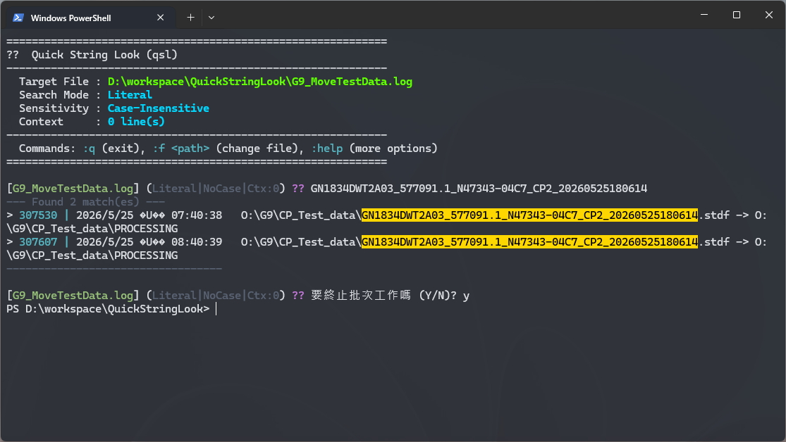

# Quick String Lookup (qsl) 🔍


一個快速、互動式的文字與日誌檔案搜尋工具，基於 PowerShell 內建的 `Select-String` 指令進行封裝。

此工具讓您**在開始時指定一次目標檔案**，後續只要直接輸入要搜尋的字串即可，無需重複輸入檔名！

---

## ✨ 功能特色

- **互動式搜尋迴圈**：持續搜尋同一個檔案，省去重複輸入檔名的麻煩。
- **高質感終端機高亮**：自動以亮麗色彩（黃底黑字）標記匹配文字，並將行號顯示為青色。
- **即時互動指令**：支援在搜尋過程中隨時切換檔案、調整大小寫敏感度、切換 Regex / Literal 搜尋模式、以及設定前後上下文行數（Context）。
- **自動檔案掃描**：若啟動時未提供任何引數，工具會自動掃描目前目錄下的日誌與文字檔，讓您以編號快速選取。
- **防洗版保護機制**：若匹配結果超過 100 筆，會先提示確認，防止大量輸出導致終端機卡頓。

---

## 🚀 使用方式

在工具所在的目錄中開啟 PowerShell，並執行以下指令：

### 1. 互動式搜尋模式（推薦）
指定您要搜尋的日誌檔案啟動：
```powershell
.\qsl.ps1 .\G9_MoveTestData.log
```
*提示：如果直接執行 `.\qsl.ps1`，工具會掃描當前資料夾並列出所有文字檔（如 `.log`, `.txt` 等），輸入編號即可載入。*

### 2. 單次搜尋模式（非互動式）
如果您只想進行單次快速搜尋並立即退出，可傳入第二個搜尋關鍵字引數：
```powershell
.\qsl.ps1 .\G9_MoveTestData.log "GN1834DWT2A03_577091.1"
```

---

## 🛠️ 互動指令

在互動搜尋模式中，您可以輸入以冒號（`:`）開頭的指令來即時自訂搜尋設定：

| 指令 | 縮寫 | 說明 |
| :--- | :--- | :--- |
| `:help` | `:h` | 顯示指令說明選單 |
| `:file <路徑>` | `:f <路徑>` | 將搜尋目標切換至其他檔案 |
| `:literal` | `:l` | **（預設）** 切換為純文字匹配模式（搜尋字串中的正則符號如 `.` 或 `[` 將視為一般文字） |
| `:regex` | `:r` | 切換為「正規表示式（Regex）」匹配模式 |
| `:case` | `:c` | 切換大小寫敏感度（預設為不區分大小寫） |
| `:ctx <行數>` | `:context <行數>` | 設定顯示匹配行前後的上下文行數（例如：`:ctx 2`） |
| `:exit` 或 `:q` | `:q` | 退出工具並返回原本的終端機 |

---

## ⚙️ 設定全域 `qsl` 快捷指令

為了能在**任何目錄**下以更簡潔的指令啟動（例如：`qsl .\G9_MoveTestData.log`），需要進行以下設定：

在本機二進位資料夾（已存在於系統 `PATH` 中）內建立一個輕量級包裝檔 `qsl.cmd`。

1. 檢查或建立目錄：`C:\Users\<您的使用者名稱>\.local\bin`
2. 在該目錄下建立名為 `qsl.cmd` 的檔案，內容如下：
   ```cmd
   @echo off
   powershell -ExecutionPolicy Bypass -File "D:\workspace\QuickStringLookup\qsl.ps1" %*
   ```
3. 重新開啟終端機，您即可在任何資料夾中直接輸入 `qsl` 進行搜尋！

---

## 🧪 搜尋畫面預覽

